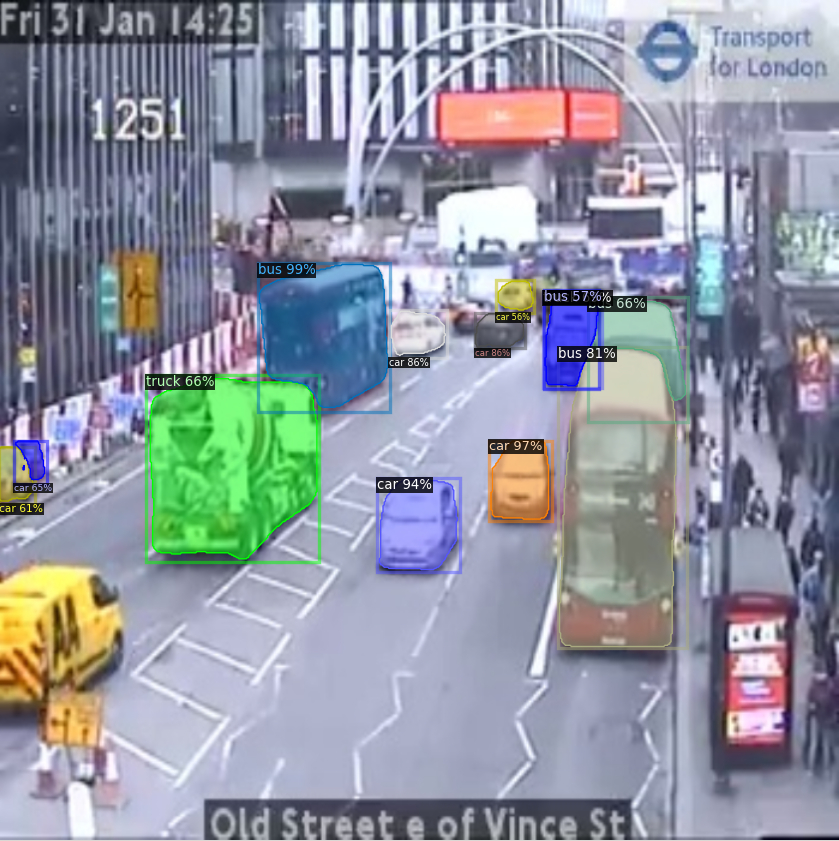
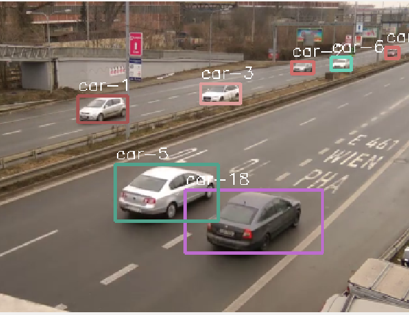
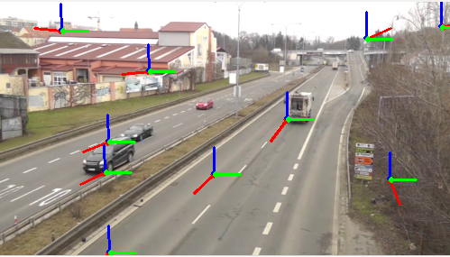
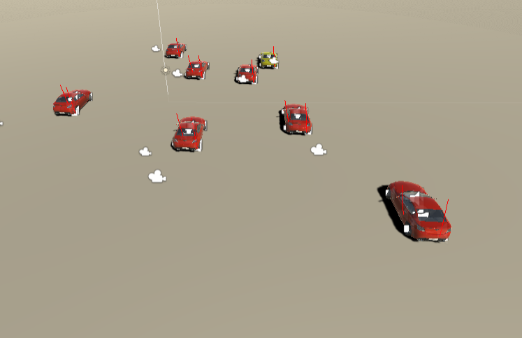

# Scene understanding and pedestrian/vehicle tracking from traffic cameras

The increase of vehicles in urban environments has raised the importance of decreasing car accidents, managing traffic congestion and building automated transportation systems. In this repository, an automatic traffic surveillance system is proposed that uses traffic camera videos of different resolutions. The objective is implemented in three core steps, the first step is the object detection on the scene, the second objective is multiple object tracking and thirdly is the depth estimation which translates coordinates on the image to coordinates on the road plane. The automatic traffic surveillance system provides, obtained trajectories of vehicles and pedestrians, estimated instantaneous and average speeds and translation of tracked trajectories to OpenScenario format.

## Getting Started

Requires Linux Ubuntu 16.04 (or more recent version) / Python 3

### Setup


1) **enviroment.yml file provides conda enviroment named "app" with installed dependencies.**

2) **Make sure Detectron2 is installed in the conda enviroment. ( instructions: https://github.com/facebookresearch/detectron2/blob/master/INSTALL.md )**

3) **Conda enviroment provides pytorch version only for CPU, make sure that a pytorch version with CUDA is installed if application to be tested on GPU.**


### Instructions


**1) Create and activate Conda enviroment**<br/>
		```conda env create -f environment.yml```
		```conda activate app```

**2) TFL traffic cameras video acquisition**<br/>
		*GPU/CPU: ```python get_videos.py```

(Suppose having a video file called "test.mp4") <br/>
**3) Run Application**<br/>
		*CPU: ```python Overall.py test.mp4 --coordfile test.txt``` <br/>
		*GPU: ```python Overall.py test.mp4 --coordfile test.txt --use_cuda True```

**4) Trajectories plot**<br/>
		*GPU/CPU: ```python get_trajectory.py --input_coords test.txt --output_name test```<br/>
		(Resulting plot shown in Results Folder)

**5) Speed Estimates**<br/>
		*GPU/CPU: ```python get_speed.py --input_video test.mp4 --input_coords test.txt --output_speeds test_speed.txt```<br/>
		(test_speed.txt file in Results Folder)

**6) OpenScenario file generation**<br/>
		*GPU/CPU: ``` python ToSimulation.py --input_video test.mp4 --input_coords test.txt --output_name test```<br/>
		(test.xosc file in Results Folder)
		
## Photos
**Object Detector**<br/>
<br/>


**Object Tracker**<br/>
<br/>

**Depth Estimator**<br/>
<br/>

**Simulator (not provided)**<br/>



## Author

[Spyridon Couvaras](https://www.linkedin.com/in/spyridon-couvaras-8611a714a/)  <br/>
Email: sv.couvaras@gmail.com

## Video

https://www.youtube.com/watch?v=nomez0_uHzo

## Acknowledgments

* [Prof. Demiris Yiannis](https://www.imperial.ac.uk/people/y.demiris)
* [Mr Rodrigo Chacon Quesada](https://www.imperial.ac.uk/personal-robotics/people/phd-students/rodrigo-chacon-quesada/)
* [Transport Systems and Logistics Laboratory](https://www.tslab.org/)
